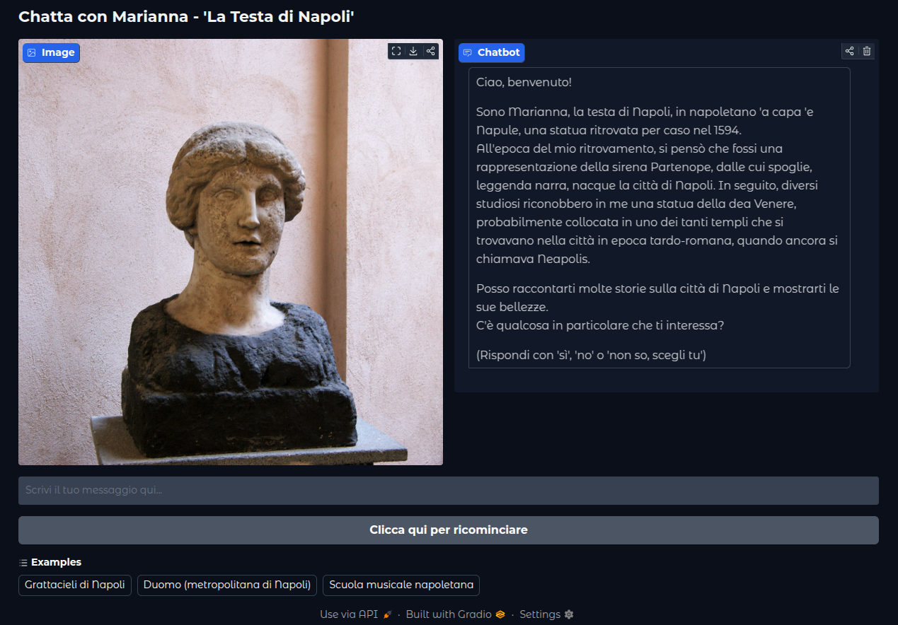

# Talking Head: Marianna

Marianna is an Italian virtual agent designed to share the rich cultural heritage, fascinating history, and captivating legends of Naples, Italy. Through interactive conversations, she brings to life the stories that have shaped Naples, one of the world's most ancient cities.



Try to chat with [Marianna](https://huggingface.co/spaces/HipFil98/Testa_di_Marianna) and discover her knowledge!

## The Story Behind the Name

Our virtual guide takes her name from a fascinating piece of Neapolitan history known as "Donna Marianna 'a cap'e Napule" (Donna Marianna, the head of Naples). In the 17th century, a large marble head of a woman was discovered in the Piazza Mercato area. This remarkable find was documented in Carlo Celano's 1692 work "Notizie del bello, dell'antico e del curioso della città di Napoli" (News of the beautiful, the ancient, and the curious of the city of Naples), where it was identified as the head of the mythical Siren Parthenope.

The people of Naples affectionately named this artifact "'a cap'e Napule," and it became a beloved symbol of the city's rich historical and mythological heritage. Today, this impressive marble head is preserved in Palazzo San Giacomo, Naples' City Hall, where it continues to inspire and connect present-day Naples with its ancient past.

## Features

- Knowledge base powered by BerkeleyDB
- vector search with Sentence-transformers 
- Integration with Ollama for language reformulation
- Interactive conversational interface using Gradio
- Easy-to-use reset functionality
- Example queries for better user engagement

## Prerequisites

- Python 3.10.12
- [Gradio](https://www.gradio.app/)
- BerkeleyDB
- [llama.cpp](https://github.com/ggml-org/llama.cpp)
- [sentence-transformers](https://sbert.net/)

## Installation

1. Clone the repository:
```bash
git clone https://github.com/RaffaeleMann/Marianna_head.git
cd Marianna_head
```

2. Install the required dependencies:
```bash
pip install gradio berkeleydb llama-cpp-python sentence-transformers
```

3. Set up the database paths in the code:
- Update the database paths in `Marianna_head` class initialization to match your system configuration
- Ensure the image path for Marianna's portrait is correctly set

## Usage

1. Start the chatbot:
```bash
Marianna_chat.py
```

2. Access the web interface through your browser at `http://localhost:7860`

3. Interact with Marianna by:
- Responding to her welcome message with 'sì', 'no', or 'non so, scegli tu'
- Asking questions about Naples' history and culture
- Using the example queries provided in the interface


## Contributing

Contributions are welcome! Feel free to:
- Add new historical facts and legends to the databases
- Improve the conversation flow
- Enhance the user interface
- Fix bugs and improve code quality

Please submit pull requests for any improvements you'd like to contribute.

## License

This project is licensed under the MIT License. For details, see the [LICENSE file](https://github.com/RaffaeleMann/Marianna_head/blob/main/LICENSE).

## Acknowledgments

- The city of Naples for preserving this important cultural artifact
- The University of Napoli l'Orientale
- all the organizers of the project Case Tecnologie Emergenti - Infiniti Mondi Napoli Innovation City
- All contributors who help maintain and improve this project
